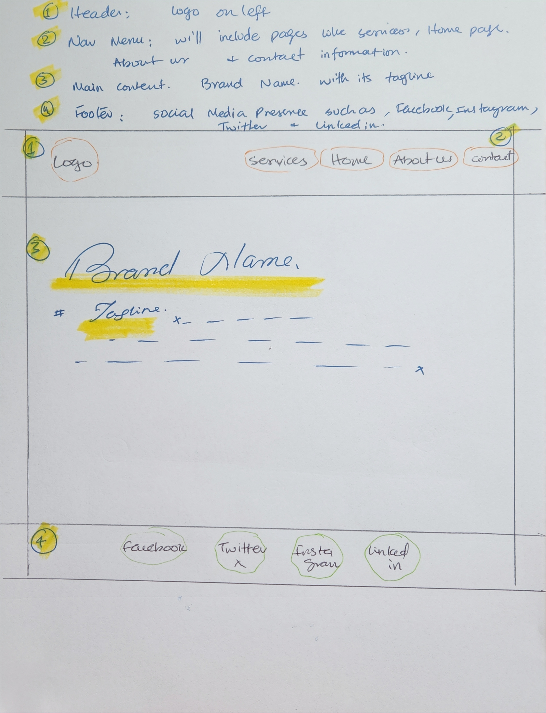
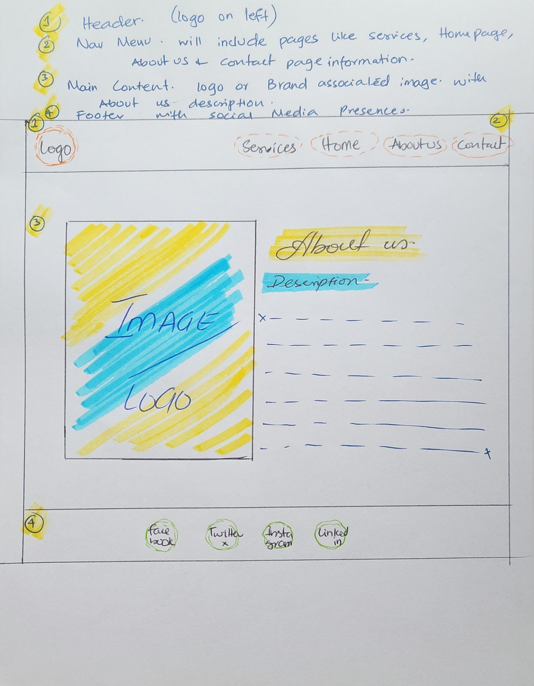
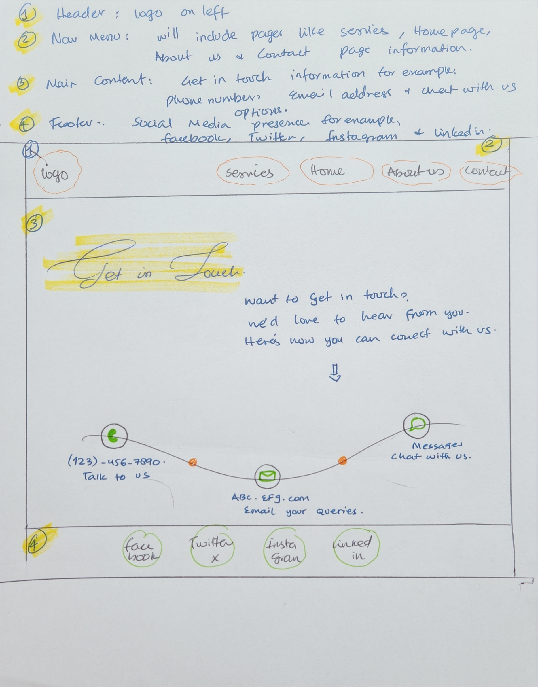

# *Rizq Industries*
Connecting systems with real users for smarter testing.

## *About the Website*

Rizq Industries connects companies with a skilled team of usability testers to evaluate and improve their systems through real-user testing and detailed feedback.

## *Wireframes*

Header: LOGO on the Left and SERVICES, HOME PAGE, ABOUT US and CONTACT on the right side.

Navigation Menu: Will include page links for example; SERVICES, HOME PAGE, ABOUT US, CONTACT

Main Content: Home page is going to have BRAND NAME and its TAGLINE

Footer: Will Include social media presence such as FACEBOOK, TWITTER, INSTAGRAM, LINKEDIN

Header: LOGO on the Left and SERVICES, HOME PAGE, ABOUT US and CONTACT on the right side.

Navigation Menu: Will include page links for example; SERVICES, HOME PAGE, ABOUT US, CONTACT

Main Content: About us page is going to have BRAND LOGO or BRAND IMAGE along with ABOUT US DESCRIPTION

Footer: Will Include social media presence such as FACEBOOK, TWITTER, INSTAGRAM, LINKEDIN

Header: LOGO on the Left and SERVICES, HOME PAGE, ABOUT US and CONTACT on the right side.

Navigation Menu: Will include page links for example; SERVICES, HOME PAGE, ABOUT US, CONTACT

Main Content: Cntact page will have all the details on how to contact for instance GET IN TOUCH with us via PHONE, EMAIL or CHAT

Footer: Will Include social media presence such as FACEBOOK, TWITTER, INSTAGRAM, LINKEDIN

